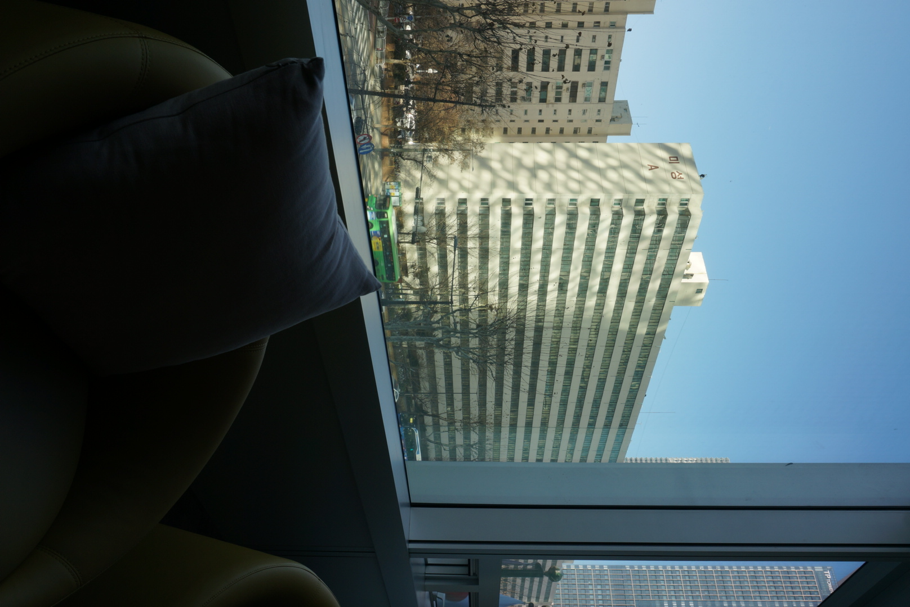
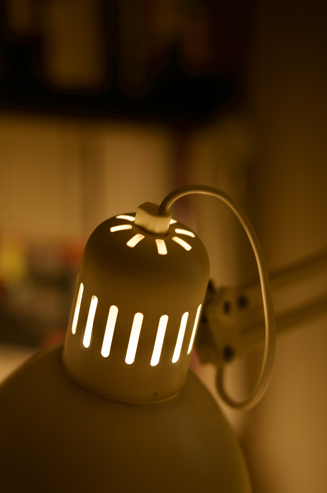

# 👋 안녕하세요, 제 홈페이지에 오신 걸 환영합니다!

## 📸 My Photo Gallery
여기에 제가 찍은 사진들과 기록들을 남길 예정입니다.

### 갤러리 모음

  
  
  

  

    
  

  

    
  

  

    
  

  

    
  

  

    
  

  

    
  

* **취미:** 사진 찍기, 코딩 공부
* **목표:** 멋진 나만의 웹사이트 완성하기
